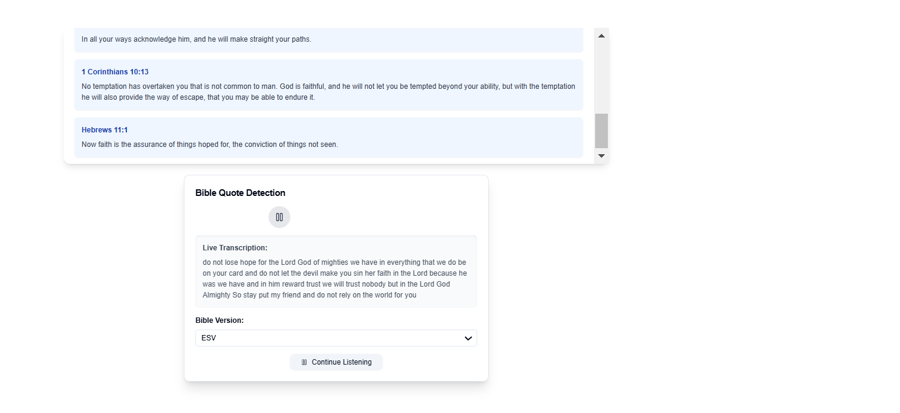

# Sermon AI - Next.js Application

## Overview
Sermon AI is a Next.js application that analyzes spoken text for Bible references using Google's Gemini AI. It supports multiple Bible versions (KJV, ESV, and NIV) and extracts scripture passages from provided speech input.

## Features
- Speech-to-text processing (initially tested with Vosk but found slow on free hosting).
- Bible reference extraction using AI.
- Support for three Bible versions (KJV, ESV, NIV).
- Streamed API responses to minimize latency.

## Installation
```sh
# Clone the repository
git clone https://github.com/your-repo/sermon-ai.git
cd sermon-ai

# Install dependencies
npm install

# Set up environment variables
cp .env.example .env
# Add your Google Gemini API key to .env
```

## Running Locally
```sh
npm run dev
```

## API Response Format
The backend returns data in the following JSON format:
```json
{
  "type": "quote",
  "data": {
    "reference": "Book Chapter:Verse",
    "text": "Verse text here",
    "version": "KJV"
  }
}
```

## Hosting Attempts
### Vercel
- Free tier limit exceeded (Edge Function exceeded 1MB size limit)
- Error received:
  ```
  Error: The Edge Function "api/stream" size is 3.79 MB and your plan size limit is 1 MB.
  ```

### Render
- Hosted the backend on Render at https://backend-lx3t.onrender.com.
- Free plan performance was slow for Vosk-based speech recognition.

## Screenshots
### Input Screen


### Result Screen


## Future Improvements
- Optimize function sizes for Vercel hosting.
- Explore alternative speech-to-text APIs with better performance on free tiers.
- Implement caching and indexing for faster Bible verse lookups.

## Credits
- Bible JSON data sourced from [jadenzaleski/BibleTranslations](https://github.com/jadenzaleski/BibleTranslations).

